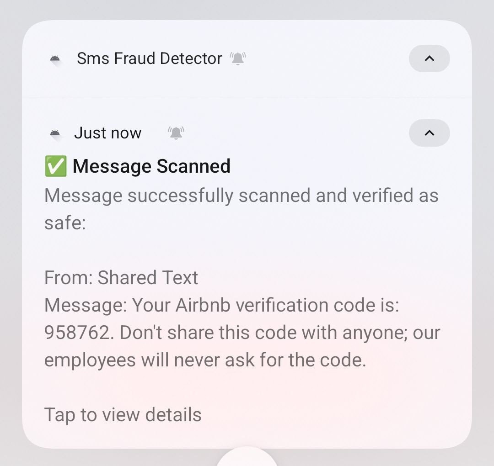

# SMS Fraud Detector

A privacy-focused Android app that scans incoming SMS messages for fraud using on-device LLM (large language model) inference. Features onboarding for new users, real-time notifications, message history, and advanced model management—all processed locally for maximum privacy.

## Purpose

Monitors all incoming SMS messages and analyzes them for potential fraud indicators using local LLM (large language model) inference. Users receive instant notifications and can review a history of analyzed messages. Onboarding guides new users through permissions, privacy, and app features.

## Key Features

- **Onboarding flow** – Guides new users through permissions, privacy, and app features
- **Real-time SMS monitoring** – Automatically scans all incoming messages
- **Instant notifications** – Fraud warnings and safe confirmations
- **Local processing** – No internet or backend required for detection
- **Privacy-focused** – All analysis happens on device
- **AI-powered fraud detection** – Supports local LLM models for advanced analysis
- **Model management** – Download, configure, and debug LLMs in-app
- **Message history** – Persistent storage and review of all analyzed messages
- **Manual flagging** – Users can flag, delete, or report suspicious messages
- **Permission management** – Proper runtime permission requests
- **Share integration** – Analyze arbitrary text shared from other apps

## How It Works

1. On first launch, onboarding guides users through permissions and privacy.
2. App requests SMS and notification permissions.
3. Monitors incoming SMS messages in real-time.
4. Scans each message for fraud indicators using LLMs.
5. Stores analysis results in a local database.
6. Shows warning notification for potential fraud, or confirmation for safe messages.
7. Allows users to review, flag, or delete messages in history.
8. Users can share text from other apps for fraud analysis.

## LLM Integration

- Download and manage local LLMs (e.g., via HuggingFace)
- Configure model settings and tokens in-app
- Run fraud detection using on-device inference (no cloud required)
- Debug and test LLM responses with a dedicated UI

## Testing

- Send yourself an SMS containing the word "fraud" to see a warning notification, or any other message to see a safe confirmation.
- Use the LLM Debug screen to test model responses with custom messages.

## Development & Extensibility

- Modular architecture: easily swap LLM models or add new ones
- UI built with Jetpack Compose (Material 3)
- Manual testing recommended; see [`AI-context.md`](AI-context.md:1) for details
